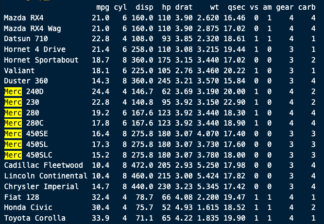
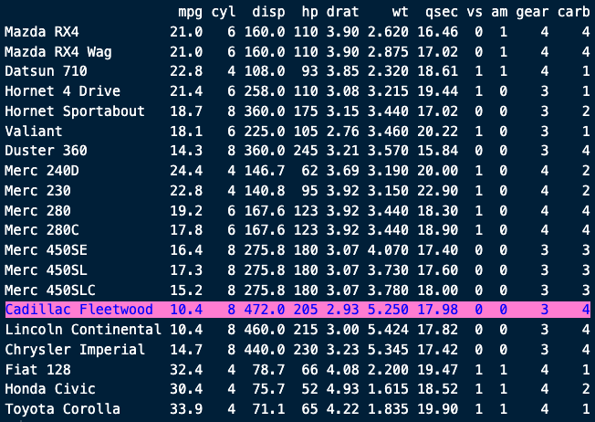
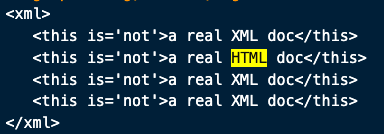
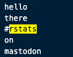
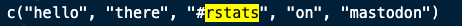

<!-- README.md is generated from README.Rmd. Please edit that file -->

```{r, include = FALSE}
knitr::opts_chunk$set(
  collapse = TRUE,
  comment = "#>",
  fig.path = "man/figures/README-",
  out.width = "100%",
  eval = FALSE
)

library(cgrep)
```

# cgrep

<!-- badges: start -->

<!-- badges: end -->

`cgrep` is a package for highlighting character representations of R objects
using regular expressions.

## What's in the box:

* `cgrep()` for working directly on character strings
* `cgrep_character()` matches against the `as.character()` output of the object
* `cgrep_deparse()` matches against the `deparse1()` output
* `cgrep_print()` matches against the default `print()` output of the object
* `cgrep_str()` matches against the `str()` representation

## Installation

You can install from [GitHub](https://github.com/coolbutuseless/cgrep) with:

``` r
# install.package('remotes')
remotes::install_github('coolbutuseless/cgrep')
```

## Example: Highlight a string in a data.frame

```{r example}
library(cgrep)

mtcars |> 
  head(20) |>
  cgrep_print("Merc")
```



### Highlight a row in a data.frame which matches a word

```{r}
mtcars |> 
  head(20) |>
  cgrep_print("^.*wood.*?$", fg = 'blue', bg = 'hotpink')
```




### Highlight text in a string

```{r}
string <- 
"<xml>
   <this is='not'>a real XML doc</this>
   <this is='not'>a real HTML doc</this>
   <this is='not'>a real XML doc</this>
   <this is='not'>a real XML doc</this>
</xml>"

cgrep(string, "html", ignore.case = TRUE)
```





### Highlighting within a character vector
```{r}
vals <- c('hello', 'there', '#rstats', 'on', 'mastodon')

cgrep(vals, "rstats")
```



```{r}
cgrep_deparse(vals, "rstats")
```




## Related Software

* [emphatic](https://github.com/coolbutuseless/emphatic)

## Acknowledgements

* R Core for developing and maintaining the language.
* CRAN maintainers, for patiently shepherding packages onto CRAN and maintaining
  the repository
